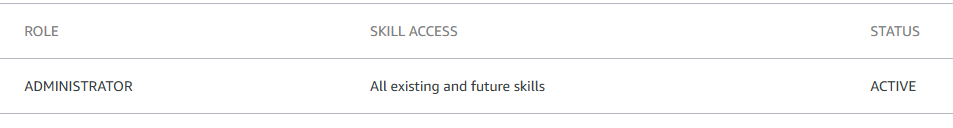

# Music Assistant Alexa Skill Prototype
This project is an Alexa skill prototype for controlling the Music Assistant server. It provides a Flask-based web service, an Alexa skill handler, an API, and ASK CLI integration with Docker deployment support.

## How to Run

#### Prerequisites

- An Amazon developer account: https://developer.amazon.com/en-US/docs/alexa/ask-overviews/create-developer-account.html
- Skill Access Management enabled for your developer account: [https://developer.amazon.com/alexa/console/ask/settings/access-management](https://developer.amazon.com/alexa/console/ask/settings/access-management)
    
- Docker & Docker Compose installed on your host
- A public HTTPS endpoint for the skill

### 1. Using Docker Compose (Recommended)

The easiest way to run the project is with Docker Compose. This will build and start the Alexa skill container with required environment variables, secrets, and an optional persistent ASK credential volume.

#### Steps:

1. Ensure `docker-compose.yml` is present and edit environment variables as needed (e.g., `SKILL_HOSTNAME`, `MA_HOSTNAME`, `PORT`). See the [Environment Variables](#environment-variables) section below for details on each variable.
2. (Optional) Create `./secrets/app_username.txt` and `./secrets/app_password.txt` to provide `APP_USERNAME` and `APP_PASSWORD` for basic authentication of the web UI and API.
3. (Optional) To persist ASK CLI credentials across container restarts, mount a volume to `./<host directory>:/root/.ask`, `./ask_data` is used by default.
4. Start the service:

    ```sh
    docker compose up -d
    ```

5. The service will be available at `http://localhost:5000` (or the IP/port you configured).
6. In your browser, open the setup UI at `http://localhost:5000/setup`. The setup page will:
   - detect existing persistent ASK credentials (if present) and skip the browser-based auth flow
   - guide you through the ASK CLI authorization flow if credentials are not present
   - run the automated skill creation/update, interaction model upload, model build polling, and testing enablement.

Note: manual creation of the skill in the Alexa Developer Console is no longer required — the `/setup` flow automates creation and enablement when possible.

### 2. Home Assistant add-on (untested)

This repository contains an `addons/music-assistant-skill` folder with a simple Home Assistant add-on wrapper. Running it as an add-on in your environment may require additional changes.

If you want to test as an add-on locally:

1. Add this repository as a custom add-on repository in Home Assistant Supervisor (Supervisor > Add-on Store > Repositories).
2. Install the "Music Assistant Alexa Skill" add-on and open the add-on configuration.
3. In the add-on configuration, set the options described above (`MA_HOSTNAME`, `APP_USERNAME`, `APP_PASSWORD`, `PORT`, `DEBUG_PORT`, `AWS_DEFAULT_REGION`) as needed.
4. Start the add-on and check the add-on logs for startup and any missing dependencies or configuration issues.

**Warning**: Treat this add-on as a user convenience and validate thoroughly as this method has not been tested in a Home Assistant environment and may require adjustments to work properly as an add-on.

### 3. Using `docker run`

Run the published GitHub Container Registry image with `docker run`. Replace the image tag below with the appropriate tag or digest if needed.

```sh
docker run --rm \
    -p 5000:5000 \
    -e SKILL_HOSTNAME=alexa.example.com \
    -e MA_HOSTNAME=ma.example.com \
    -e PORT=5000 \
    -e LOCALE=en-US \
    -e AWS_DEFAULT_REGION=us-east-1 \
    -v "$(pwd)/ask_data:/root/.ask" \
    -v "$(pwd)/secrets/app_username.txt:/run/secrets/APP_USERNAME:ro" \
    -v "$(pwd)/secrets/app_password.txt:/run/secrets/APP_PASSWORD:ro" \
    ghcr.io/alams154/music-assistant-alexa-skill-prototype:latest
```

Notes:
- Adjust `SKILL_HOSTNAME` to the public HTTPS host you'll use in the skill manifest.
- The `ask_data` volume persists ASK CLI credentials so the setup flow can reuse them.
- Mounting files into `/run/secrets` is a simple way to provide secrets for local testing; for production use Docker secrets or your platform's secret manager.

### Environment Variables

| Variable | Required | Default | Description |
|---|:---:|:---:|---|
| `SKILL_HOSTNAME` | Yes | — | Must be a publicly reachable HTTPS host (example: `alexa.example.com`). Should proxy to your open port on this container (port **5000** by default).  Public hostname used in the Alexa skill manifest and to validate the skill endpoint. |
| `MA_HOSTNAME` | *No | — | ***REQUIRED** if your device does not have a display (does not support APL). Music Assistant server hostname (example: `ma.example.com`). Should proxy to your stream port on the Music Assistant server (port **8097** by default). Also required if you would like album art on your APL device. |
| `APP_USERNAME` | No | — | Username for the web UI and API basic authentication. In Docker Compose this is provided via a Docker secret (`/run/secrets/APP_USERNAME`) pointing to `./secrets/app_username.txt`, or as a plain env var when not using secrets. |
| `APP_PASSWORD` | No | — | Password for the web UI and API basic authentication. Can be supplied as a Docker secret file or plain env var. |
| `PORT` | No | `5000` | Port the app lives at. Ensure the `ports` mapping in [docker-compose.yml](docker-compose.yml) matches this value. |
| `DEBUG_PORT` | No | `5678` | Remote debug port (if you enable remote debugging). |
| `LOCALE` | *No | `en-US` | ***REQUIRED** if your device is not configured for en-US. Skill locale used by the setup and interaction model operations (examples: `en-US`, `en-GB`, `de-DE`). |
| `AWS_DEFAULT_REGION` | No | `us-east-1` | AWS region used by ASK CLI operations when applicable. |
| `TZ` | No | `UTC` | Container timezone (example: `America/Chicago`) to make logs/timestamps match your locale. |

**Secrets and persistence**

- The example [docker-compose.yml](docker-compose.yml) demonstrates using Docker secrets for `APP_USERNAME` and `APP_PASSWORD` (files in `./secrets`). When using Docker secrets, the container environment will contain the path to the secret file (for example `/run/secrets/APP_PASSWORD`) and the service reads the file content.
- To persist ASK CLI credentials between container runs, mount a host directory as `/root/.ask` (the example uses `./ask_data:/root/.ask`). This allows the setup flow to reuse existing ASK credentials and skip the browser auth flow when present.

**Notes on values**

- `SKILL_HOSTNAME` must refer to a public HTTPS endpoint reachable by Amazon; it is embedded in the skill manifest and used for endpoint validation.
- If you override `PORT` or `DEBUG_PORT`, update the `ports` mapping in [docker-compose.yml](docker-compose.yml) accordingly (host:container).

## Basic Troubleshooting
### Status Page
`/status`

Returns a simple status page showing the local API health and an ASK CLI driven check for whether the Music Assistant skill exists, whether its endpoint matches `SKILL_HOSTNAME`, and whether testing is enabled. When the check is not green, the status page provides a quick link to `/setup`.

---

See [COMPATIBILITY.md](COMPATIBILITY.md) for known supported devices, languages, and regions.

See [LIMITATIONS.md](LIMITATIONS.md) for known limitations.

See [DISCLAIMER.md](DISCLAIMER.md) for security concerns and development disclosures.

