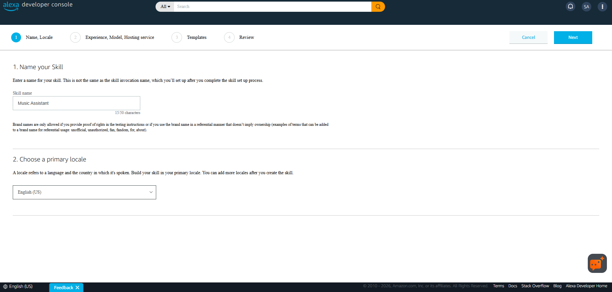
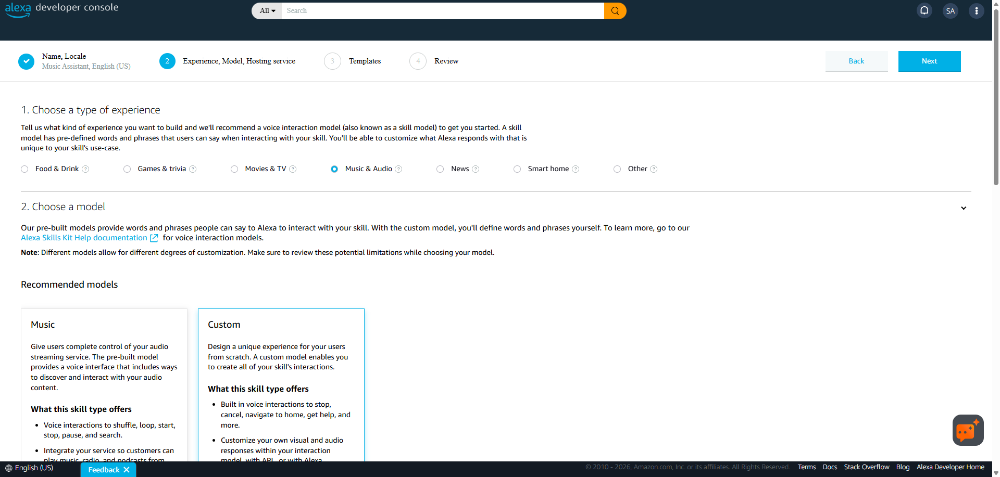
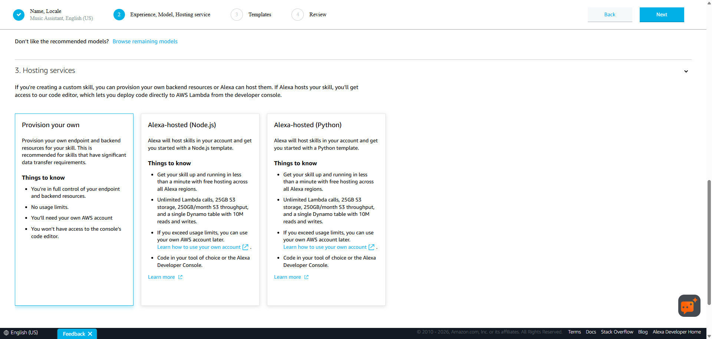
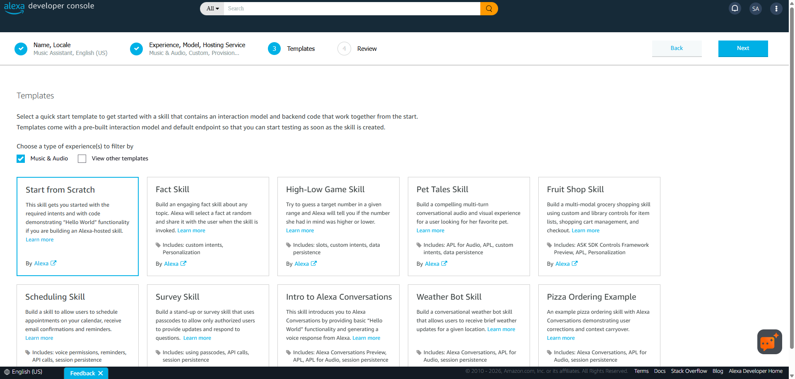
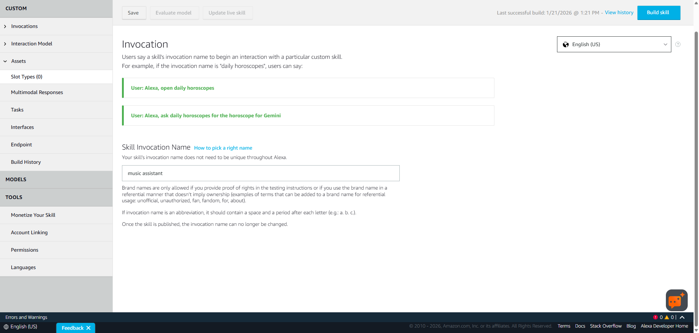
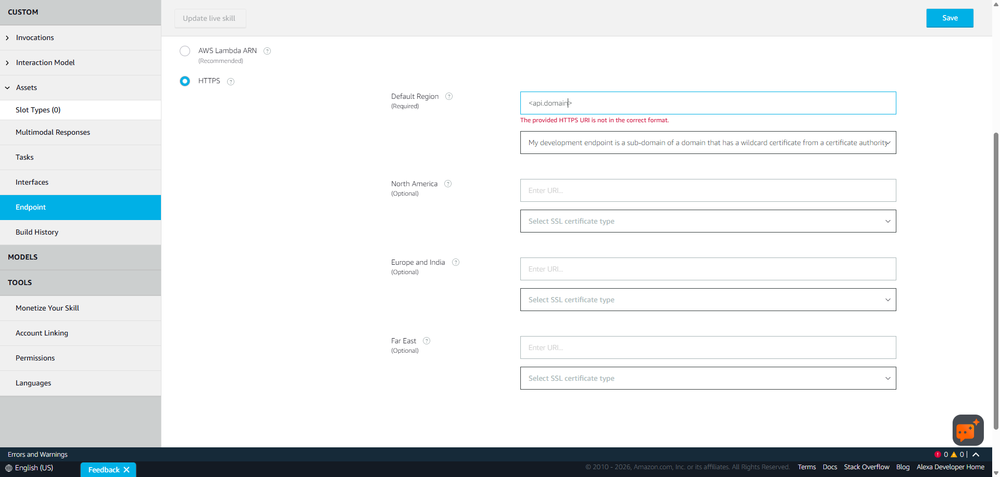
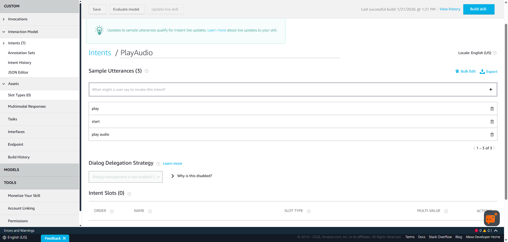
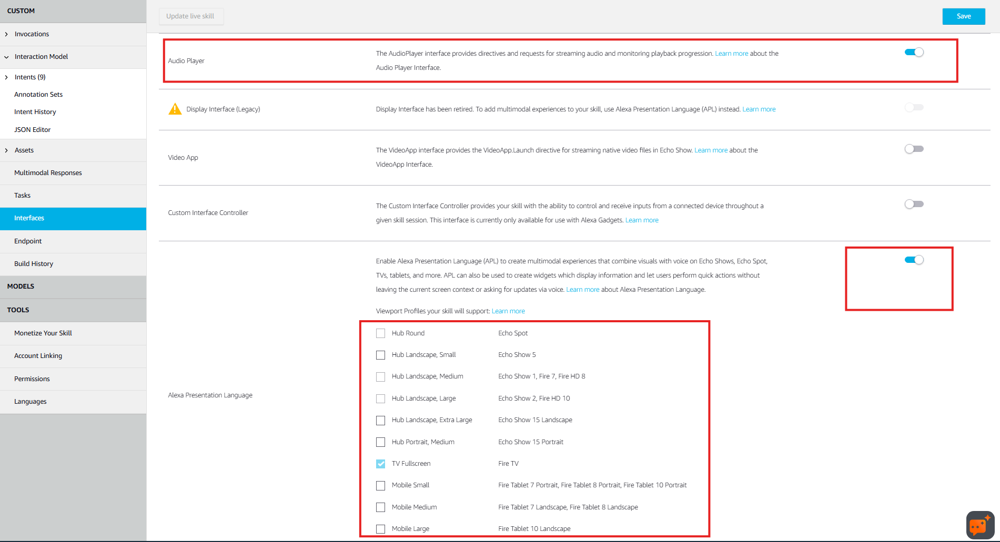
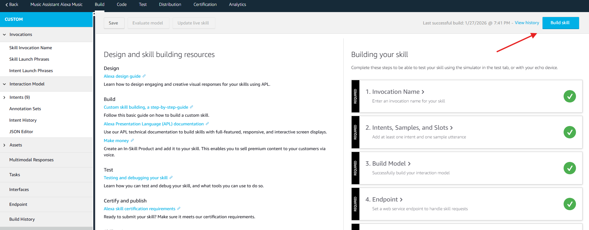
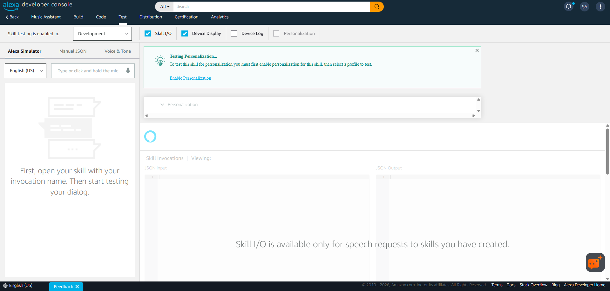

# Music Assistant Alexa Skill Prototype
This project is an Alexa skill prototype for controlling the Music Assistant server. It provides a Flask-based web service, Alexa skill handler, and API, with support for Docker deployment.

## How to Run

### 1. Using Docker (Recommended)

The easiest way to run the project is with Docker Compose. This will build and start the Alexa skill container with all required environment variables and secrets.

#### Steps:

1. **Copy the docker-compose.yml** and ensure Docker and Docker Compose are installed
2. **Set up secrets or proceed to step 3:**
	- Place your API username in `./secrets/api_username.txt` (Relative to your docker-compose.yml file)
	- Place your API password in `./secrets/api_password.txt` (Relative to your docker-compose.yml file)
3. **Edit environment variables** in `docker-compose.yml` as needed (e.g., `MA_HOSTNAME`, `PORT`, `API_USERNAME`, `API_PASSWORD`)
4. **Start the service:**

	```sh
	docker compose up -d
	```

5. The service will be available at `http://localhost:5000` (or the IP/port you configured)
6. Setup a reverse proxy for the Alexa skill endpoint (port 443 required)
7. Create a skill in the Alexa Developer Console (https://developer.amazon.com/alexa/console/ask) pointing to your public HTTPS endpoint
    -   Click Create Skill and add "Music Assistant" as the Skill name and select your primary locale

        

    -   Select Music & Audio as the experience, Custom as the model, and "Provision your own" as the hosting service

        

        

    -   Choose "Start from Scratch" as the template

        

    -   Click the Invocation Name field and type in "music assistant" and hit save

        

    -   Click the Endpoint field, change it to HTTPS, fill in your HTTPS endpoint in Default Region, select the wildcard certificate option, and hit save

        

    -   On the left side go to Interaction Model > Intents, add an Intent named PlayAudio with the Sample Utterances "play audio", "start", and "play", and hit save

        

    -   On the left side go to Interfaces and enable the interfaces for "Audio Player" and "Alexa Presentation Language" (additionally: Select the devices that you use). Then hit save.

        

    -   Navigate to the main page under "CUSTOM" on the left side and hit "Build skill"

        

    -   Navigate to the Test tab, change Off to Development

        
	

## Basic Troubleshooting
### Status Page
`/status`

Returns a simple status page API return code and checked endpoint


---

See [COMPATIBILITY.md](COMPATIBILITY.md) for known supported devices, languages, and regions.

See [LIMITATIONS.md](LIMITATIONS.md) for known limitations.

See [TODO.md](TODO.md) for future improvements

